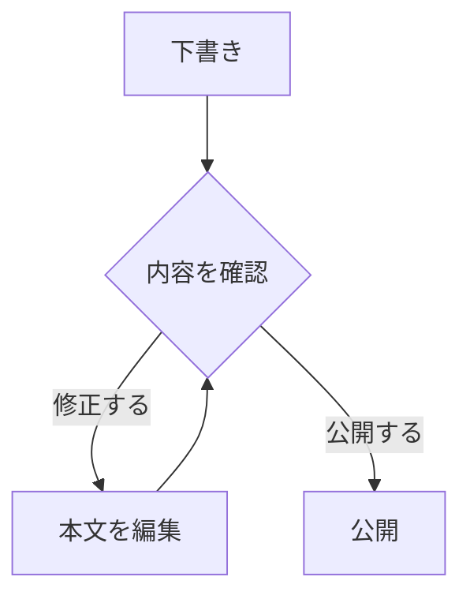

このファイルは、ブログ記事を書くためのサンプルです。frontmatter の項目、見出し、本文、リスト、引用、表、コード、画像、脚注など、よく使う要素を一通り入れています。

記事を追加するときは、このファイルをコピーして、ファイル名・タイトル・日付・本文を差し替えると始めやすいです。

## Frontmatter

記事の先頭にある `---` で囲まれた部分が frontmatter です。

```yaml
title: "記事タイトル"
description: "一覧やOGPに使われる短い説明文"
category: "Guide"
tags:
  - Markdown
  - Sample
pubDate: "2026-01-15"
updatedDate: "2026-01-20"
heroImage: "./assets/cover.png"
```

最低限必要なのは `title`、`description`、`pubDate` です。`category` と `tags` は一覧や分類ページに使われます。`updatedDate` と `heroImage` は必要なときだけ設定します。画像は記事ディレクトリ内に `assets/` を作り、`./assets/cover.png` のように相対パスで指定します。

## 見出し

本文では `##` から使うのがおすすめです。ページの `h1` はテンプレート側で記事タイトルとして表示されます。

### 小見出し

小さなまとまりを作るときは `###` を使います。

#### さらに細かい見出し

深くなりすぎると読みにくくなるため、通常は `##` と `###` を中心に構成します。

## 段落と強調

段落は空行で区切ります。1文を短めにしておくと、スマートフォンでも読みやすくなります。

重要な語句は **太字**、補足的なニュアンスは _斜体_、設定名やファイル名は `inline code` で書けます。

## リスト

箇条書きは、手順ではない情報を並べるときに使います。

- 読者が最初に知りたいこと
- 判断に必要な前提
- 次に試せる具体的な行動

手順を書くときは番号付きリストを使います。

1. 目的を1文で書く
2. 必要な前提を整理する
3. 実際の手順を書く
4. 最後に確認方法を書く

## チェックリスト

公開前の確認項目として使えます。

- [x] タイトルが具体的になっている
- [x] 説明文が一覧で読んでも意味を持つ
- [ ] 画像の代替テキストを確認する
- [ ] コードブロックに言語名を付ける

## 引用

引用やメモを本文から少し分けたいときに使います。

> よい記事は、何をしたかだけでなく、なぜそうしたかも残します。

## 表

比較や設定値の一覧には表が便利です。

| 項目          | 必須 | 用途                         |
| ------------- | ---- | ---------------------------- |
| `title`       | Yes  | ページタイトルと記事タイトル |
| `description` | Yes  | 一覧、メタ情報、OGP          |
| `category`    | No   | カテゴリ一覧                 |
| `tags`        | No   | タグ一覧                     |
| `heroImage`   | No   | 記事上部やOGP画像            |

## コードブロック

コードブロックには言語名を付けるとシンタックスハイライトされます。

```ts
type PostStatus = "draft" | "published";

const status: PostStatus = "published";

console.log(`Current status: ${status}`);
```

差分を説明したいときは `diff` も使えます。

```diff
- title: "Old title"
+ title: "New title"
```

## Mermaid

Mermaidの図は、コードブロックの言語名に `mermaid` を指定すると表示できます。



## 画像

本文中に画像を置く場合は、相対パスで指定できます。

```md

```

画像の説明文は、画像が表示されない環境でも意味が伝わるように書きます。

## リンク

外部リンクは通常のMarkdownリンクで書けます。

[Astro documentation](https://docs.astro.build/)

内部ページへリンクするときは、サイト内のパスを使います。

[Projects](/projects/)

## 脚注

補足情報を本文の流れから分けたいときに使います。[^note]

[^note]: 脚注は長い補足や出典のメモに向いています。

## まとめ

新しい記事を書くときは、次の順番で埋めると迷いにくくなります。

1. frontmatter を先に埋める
2. `##` 見出しだけで記事の流れを作る
3. 各見出しの下に本文を書く
4. 最後にリンク、画像、コード、表の表示を確認する
